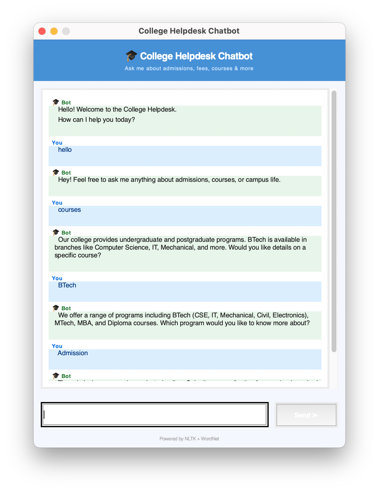

# 🎓 College Helpdesk Chatbot

A simple NLP-based chatbot that understands student queries and responds using intent matching, synonym recognition, and context handling. Built with Python, NLTK, and Tkinter.

---

## 📌 Project Overview

This project demonstrates core Natural Language Processing concepts through a functional college helpdesk chatbot. It covers semantics, pragmatics, and real-world NLP usage.

---

## 📸 Screenshot



---

## 🎯 Objectives

- Implement basic NLP techniques (tokenization, stemming, synonym matching)
- Understand **semantics** — word meaning and similarity using WordNet
- Handle **pragmatics and discourse** — intent detection and context
- Build a real-world chatbot with a graphical interface

---

## 📁 Project Structure

| File | Description |
|------|-------------|
| `chatbot.py` | Core NLP logic |
| `ui.py` | Tkinter GUI |
| `requirements.txt` | Dependencies |
| `README.md` | Project documentation |

---

## 🛠️ Tech Stack

| Tool | Purpose |
|------|---------|
| Python | Core language |
| NLTK | Natural language processing |
| WordNet | Synonym expansion |
| Tkinter | Desktop GUI |

---

## ⚙️ Setup & Installation

1. **Clone the repository**
```bash
   git clone https://github.com/NehaKadam26/nlp-chatbot.git
   cd nlp-chatbot
```

2. **Install dependencies**
```bash
   pip3 install nltk
```

3. **Download NLTK data** (run once)
```bash
   python3 -c "
   import ssl
   ssl._create_default_https_context = ssl._create_unverified_context
   import nltk
   nltk.download('punkt')
   nltk.download('punkt_tab')
   nltk.download('wordnet')
   "
```

4. **Run the GUI**
```bash
   python3 ui.py
```

---

## 💬 How It Works

1. User types a message in the chat window
2. Input is **tokenized** and **normalized**
3. **WordNet** expands tokens with synonyms
4. The chatbot matches against intents in the dataset
5. Best-matching intent's response is returned
6. **Context** is tracked across turns for multi-turn conversations

---

## 🖥️ Supported Topics

The chatbot can answer questions about:
- Greetings & goodbyes
- Courses & programs (BTech, MTech, MBA)
- Fees & scholarships
- Admissions & eligibility
- College location & directions
- Hostel & accommodation
- Placements & recruiters
- Faculty & staff
- Library & resources
- Sports & clubs
- Canteen & food
- Exams & evaluation
- Infrastructure & facilities
- Contact & support

---

## 📚 NLP Concepts Covered

- **Tokenization** — splitting input into words/tokens
- **Synonym Matching (WordNet)** — handling varied user input
- **Intent Classification** — mapping input to a known category
- **Context Handling** — maintaining conversation state

---

## ⚠️ Known Limitations

- Keyword-based matching can misfire when intent depends on conversation context
- Does not support follow-up questions like "yes" or "tell me more"
- Responses are predefined and not dynamically generated

---

## 📃 License

This project is for educational purposes as part of an NLP coursework assignment.
